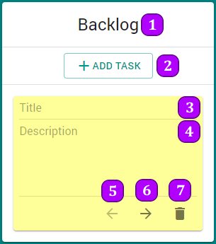

# nata.house front-end test

A simple kanban board.

# To run the project

```
npm install --g cross-env
npm install
npm start
```

# How to use?

There are 5 columns:

1. Backlog
2. To Do
3. In Progress
4. Testing
5. Done



**Column**

1. Column title
2. Add new task to this column

**Task**

3. Input for task title
4. Input for task description
5. Move task to left column
6. Move task to right column
7. Delete this task

# Questions?

Lucas Silvestre Viana

* Email: lcasviana@gmail.com
* Whatsapp/Telegram: +55 31 99731 7038